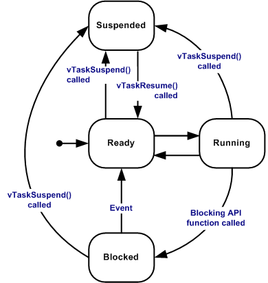

In FreeRTOS, every task is always in one of several well-defined states.



# Running State
A task is currently executing on the CPU. 

On a **single-core MCU** (most FreeRTOS systems), only one task can be Running at a time.

# Ready State
If preemption is enabled (`configUSE_PREEMPTION = 1`)

A higher-priority task will immediately preempt the Running task (even in the middle of a tick interrupt).

# Blocked State
A task enters the **Blocked** state when it is waiting for something:
- `vTaskDelay()`
- `vTaskDelayUntil()`
- Waiting for a queue
- Waiting for a semaphore
- Waiting for an event group
- Waiting for task notification

# Suspended State
A task enters **Suspended** state when:
- `vTaskSuspend()` is called
- Or it is created but scheduler not started yet

To resume:
```c
vTaskResume(taskHandle);
```

## `vTaskSuspend()`
```c
void vTaskSuspend( TaskHandle_t xTaskToSuspend );
vTaskSuspend(NULL);   // The currently running task suspends itself
```
- Moves a task into the **Suspended state**
- The task will **never run** until resumed
- No timeout
- Not related to scheduler tick

## `vTaskResume()`
```c
void vTaskResume( TaskHandle_t xTaskToResume );
```
- Moves a task from **Suspended → Ready**
- If its priority is higher than current running task ➜ It will preempt immediately (if preemption enabled)

## Difference from Blocked:
| Blocked              | Suspended                |
| -------------------- | ------------------------ |
| Has timeout or event | No timeout               |
| Auto return to Ready | Must be resumed manually |
| Used for waiting     | Used for manual control  |


# Deleted State
- The task is removed from scheduling.
- `Idle task` is responsible for cleaning up deleted tasks and releasing its memory.

## `vTaskDelete()`
```c
void vTaskDelete( TaskHandle_t xTaskToDelete );
xTaskToDelete = NULL;  // Do not forget to clear Handle
```
- The task is removed from Ready list, Blocked list and Suspended list.
- It will never run again

```c
vTaskDelete(NULL);

void TaskA(void *pv)
{
    printf("TaskA running\n");

    // Do some work

    vTaskDelete(NULL);   // delete itself

    // Code here will NEVER execute
}
```
When NULL is passed:
- The currently running task **deletes itself**
- A context switch happens immediately
